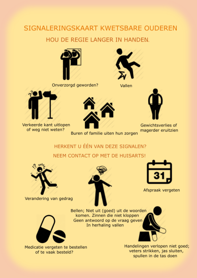

# Signaleringskaart-ouderen
Signaleringskaart die duidelijk aangeeft waneer je je zorgen moet maken over de oudere in je directe omgeving, en welke verschijnselen bij het ouder worden horen. In de ouderenzorg is het belangrijk om pro-actief te signaleren wanneer het minder gaat met de gezondheid, dat voorkomt veel ellende. De directe omgeving wordt daarbij echter nu veel te weinig betrokken. Deze signaleringskaart moet op toegankelijke wijze met pictogrammen duidelijk maken waarop de omgeving kan letten.

De kaart in zijn huidige staat van ontwikkeling ziet er zo uit:  

***

 Dit werk valt onder een <a rel="license" href="https://github.com/petradewittevaneck/Signaleringskaart-ouderen/blob/master/LICENSE.md#licentie">Creative Commons licentie met aanvullingen</a>. 
Dit is een ['social blueprint'-project](https://github.com/peterdew/SocialBlueprint_nl)
